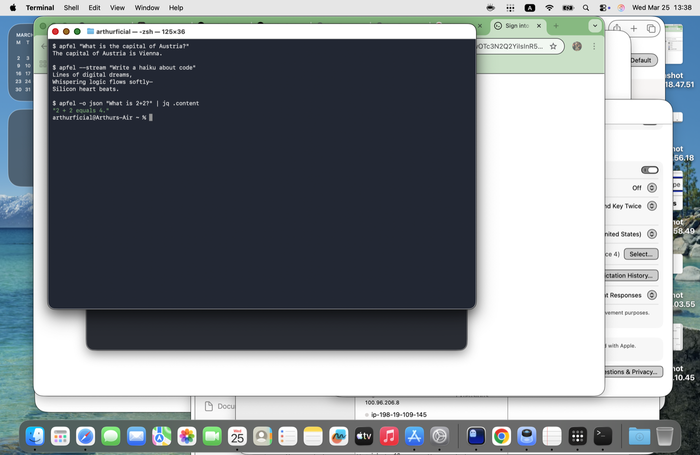
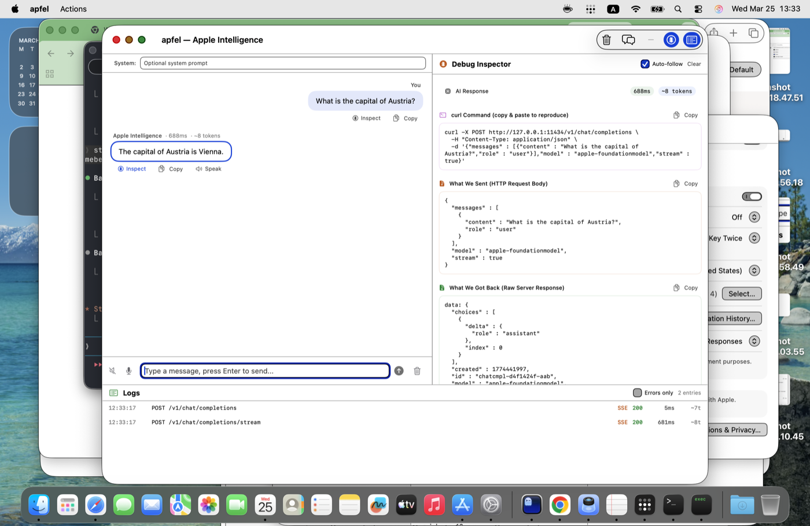

# apfel

[](https://swift.org)
[](https://developer.apple.com/macos/)
[](LICENSE)
[](https://developer.apple.com/documentation/foundationmodels)

> German for "apple."

`apfel` is a Swift wrapper around Apple's built-in FoundationModels language model.

It gives you three interfaces to the same model:

- a Unix-style CLI
- a local OpenAI-compatible HTTP server
- a native macOS debugging interface for inspecting prompts, raw responses, logs, and stream events

No API keys. No paid API. No model downloads. No cloud account.

## What This Project Actually Is

`apfel` is not trying to be a generic chat app.

The core idea is:

- expose Apple's model on the command line
- make it usable from tools that expect the OpenAI Chat Completions API
- make debugging transparent through a native GUI that shows what was sent, what came back, and how the request evolved

The GUI exists primarily as an inspector:

- request/response viewer
- raw SSE stream inspection
- live request log viewer
- error and refusal debugging
- voice input / output testing
- self-discussion / prompt comparison

If you want the shortest summary: `apfel` is a local developer-facing shell and debug harness for Apple Intelligence.

## Why

macOS 26 ships with Apple's built-in language model through `FoundationModels`.
Apple gave Swift apps an API, but not a good CLI, not an OpenAI-compatible local server, and not a transparent debugger.

`apfel` fills that gap.

## Features

- Single binary: CLI, GUI, and server
- OpenAI-compatible `POST /v1/chat/completions`
- Streaming SSE support
- Native macOS debug inspector for raw request/response payloads
- Live log viewer with expandable request body, response body, and event trace
- Voice input with explicit macOS permission handling
- Text-to-speech playback with curated default voices
- Self-discussion mode for A-vs-B prompt comparison
- Safety/refusal-aware history pruning in the GUI

## Requirements

- macOS 26 (Tahoe) or later
- Apple Silicon Mac
- Swift 6.2 command line tools
- Apple Intelligence enabled in System Settings

For voice input:

- Microphone permission
- Speech Recognition permission
- sometimes Dictation / Siri enabled, depending on macOS state

## Install

```bash
git clone https://github.com/Arthur-Ficial/apfel.git
cd apfel
make install
```

`make install`:

- kills a running `apfel --serve` or `apfel --gui`
- rebuilds release mode
- reinstalls to `/usr/local/bin/apfel`
- prompts for `sudo` only if needed

Uninstall:

```bash
make uninstall
```

## Screenshots

### CLI



### GUI Debug Inspector



## Quick Start

### CLI

```bash
apfel "What is the capital of Austria?"
```

```bash
apfel --stream "Write a haiku about shell scripts"
```

```bash
apfel --chat
```

```bash
echo "Summarize this text" | apfel
```

### GUI Debugger

```bash
apfel --gui
```

### Local OpenAI-Compatible Server

```bash
apfel --serve
```

Then point any OpenAI client at:

```text
http://127.0.0.1:11434/v1
```

## CLI Usage

### Single prompt

```bash
apfel "Translate to German: hello world"
```

### Streaming output

```bash
apfel --stream "List 5 file naming conventions"
```

### Interactive chat

```bash
apfel --chat
```

### System prompt

```bash
apfel -s "Reply in exactly five words" "What is machine learning?"
```

### JSON output

```bash
apfel -o json "What is 2+2?"
```

### Quiet scripting mode

```bash
capital=$(apfel -q "Capital of France? One word only.")
echo "$capital"
```

## Server Usage

Start the server:

```bash
apfel --serve
```

Available endpoints:

| Method | Path | Purpose |
|---|---|---|
| `POST` | `/v1/chat/completions` | Chat completion, streaming and non-streaming |
| `GET` | `/v1/models` | Static model list |
| `GET` | `/v1/logs` | Structured request logs |
| `GET` | `/v1/logs/stats` | Aggregate server stats |
| `GET` | `/health` | Health check |

Server options:

```text
--serve
--port <number>
--host <address>
--cors
--max-concurrent <n>
--debug
```

Example with Python:

```python
from openai import OpenAI

client = OpenAI(
    base_url="http://127.0.0.1:11434/v1",
    api_key="unused",
)

resp = client.chat.completions.create(
    model="apple-foundationmodel",
    messages=[{"role": "user", "content": "What is 1+1?"}],
)

print(resp.choices[0].message.content)
```

Example with `curl`:

```bash
curl -X POST http://127.0.0.1:11434/v1/chat/completions \
  -H "Content-Type: application/json" \
  -d '{
    "model": "apple-foundationmodel",
    "messages": [{"role": "user", "content": "Hello"}]
  }'
```

Streaming:

```bash
curl -N http://127.0.0.1:11434/v1/chat/completions \
  -H "Content-Type: application/json" \
  -d '{
    "model": "apple-foundationmodel",
    "messages": [{"role": "user", "content": "Hello"}],
    "stream": true
  }'
```

## GUI Debugging Interface

Launch:

```bash
apfel --gui
```

The GUI is intentionally built for transparency, not polish-first chat.

It includes:

- Chat transcript
- Inline system prompt field
- Debug Inspector panel
- Live Logs panel
- Voice input / output controls
- Self-discussion prompt playground

### Debug Inspector

For the selected message, the inspector shows:

- the exact JSON request body
- the raw server response
- the extracted visible assistant content
- a copyable `curl` reproduction command

This is the fastest way to answer:

- what did we actually send?
- what did the server actually return?
- did the UI extract the right thing?

### Logs Panel

The logs panel polls `/v1/logs` and shows structured request history.

Each row can expand to reveal:

- request body
- response body
- stream transcript
- error text
- internal event list

Streaming requests create a dedicated completion log entry so the final SSE transcript is preserved.

### Menu and Shortcuts

Toolbar:

- `Clear`
- `Self-Discuss`
- `Debug`
- `Logs`

Menu:

- `Actions > Self-Discuss…`
- `Actions > Clear Chat`

Keyboard shortcuts:

- `Cmd+K` clear chat
- `Cmd+D` toggle debug panel
- `Cmd+L` toggle logs panel
- `Cmd+J` open self-discussion

## Voice Input and Output

### Speech-to-text

The GUI microphone button:

- requests microphone permission
- requests speech-recognition permission
- opens the exact relevant System Settings pane when blocked
- changes into a clear red `Stop` control while recording
- submits the captured transcript immediately when recording stops

### Text-to-speech

Assistant playback uses curated, human-sounding defaults.

Current default language is British English.

The voice picker logic prefers:

- Siri-style voices if exposed by `AVSpeechSynthesizer`
- otherwise the best installed modern system voice
- avoids novelty and Eloquence voices unless there is no better option

## Self-Discussion

Self-discussion is a built-in A-vs-B prompt test harness.

Use it to compare:

- two system prompts
- two response styles
- two speaking voices
- two language settings

By default:

- both sides speak British English
- side A and side B use different voice variants

This makes it useful as a lightweight prompt lab, not just a gimmick.

## Safety and History Handling

The GUI intentionally excludes bad turns from future history when appropriate.

That includes:

- safety-blocked turns
- plain-text refusal turns such as `I can't assist with that request`
- empty assistant turns
- failed assistant placeholder turns

The point is to prevent one poisoned or blocked response from contaminating the next request.

## Logging Philosophy

This project is opinionated about debugging:

- every request should be inspectable
- every response should be reproducible
- streaming should not be opaque
- safety failures should not disappear into UI abstraction

That is why the GUI exists.

If you are trying to debug:

- FoundationModels behavior
- response extraction bugs
- refusal handling
- SSE handling
- OpenAI-client compatibility

the GUI is the primary tool.

## Architecture

High-level stack:

```text
CLI / GUI / OpenAI-compatible HTTP server
        ↓
FoundationModels.framework
        ↓
Apple Intelligence
  - on-device model
  - optional Private Cloud Compute routing
```

The routing between on-device execution and Private Cloud Compute is controlled by Apple's framework, not by `apfel`.

## Limitations

- macOS 26+ only
- Apple Silicon only
- one Apple model, not a model manager
- model behavior is constrained by Apple's safety and product rules
- not intended as a polished consumer chat client

## Examples

See [EXAMPLES.md](./EXAMPLES.md) for real prompts and outputs.

## Build

```bash
swift build
swift build -c release
swift package clean
```

## License

[MIT](LICENSE)
